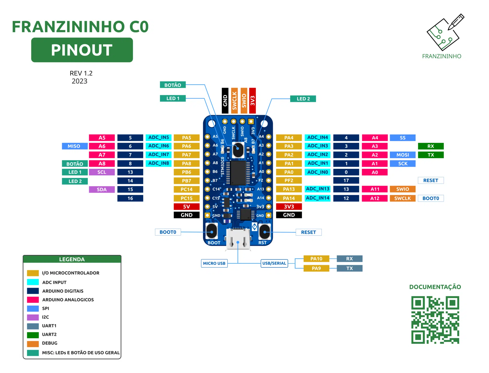

# 3D Printer Filament Dryer Project
---

---
This project involves the development of a PCB designed to integrate the **Franzininho C0** with various interfaces for power, sensor reading, and load actuation.
---

---
## Key Features:
- Mosfet Driver to DC loads
- AC Driver to SSR control and ZeroCrossing detection
- Interface to LCD Display with I2C
- Relay Driver to AC or DC loads
- Analog temperature sensor with External NTC
- Digital temperature and humidity sensor (DHT22 or equivalent)
- 4x buttons to customizable functions (Can be external)
  

**Note:** This is a flexible project that can be used in other applications, such as:

- **Smart thermostat**: Control heating and cooling systems based on temperature and humidity readings.
- **Greenhouse automation**: Manage humidity, temperature, and lighting for plant growth.
- **Water heater controller**: Regulate the temperature of water in residential or industrial settings.
- **Home automation**: Control devices like fans, lights, or appliances using sensor inputs.
- **Aquarium climate controller**: Maintain stable temperatures and monitor water quality in aquariums.
- **Dehumidifier control**: Automatically manage a dehumidifier based on humidity sensor readings.
- **Food dehydrator**: Control heating elements to dry food for preservation.

The only limit is your creativity.
