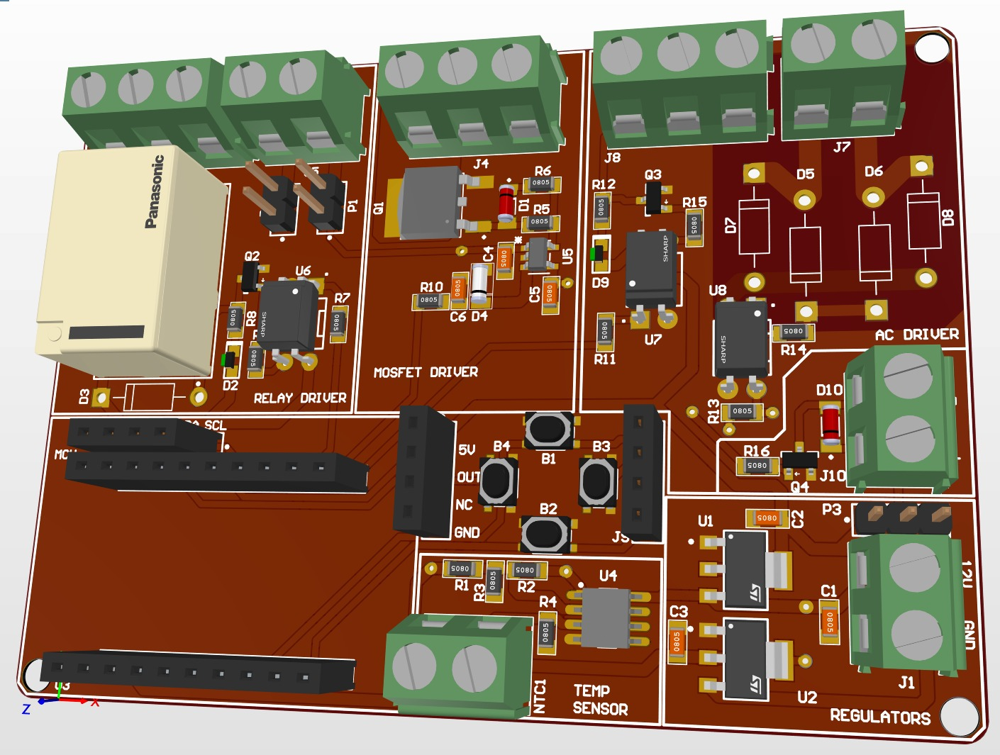

# 3D Printer Filament Dryer Project
---

---
This project involves the development of a PCB designed to integrate the **Franzininho C0** with various interfaces for power, sensor reading, and load actuation.
---

---
## Key Features:
- Mosfet Driver to DC loads
- AC Driver to SSR control and ZeroCrossing detection
- Interface to LCD Display with I2C
- Relay Driver to AC or DC loads
- Analog temperature sensor with External NTC
- Digital temperature and humidity sensor (DHT22 or equivalent)
- 4x buttons to customizable functions (Can be external)
  

**Note:** This is a flexible project that can be used in other applications, such as:

- AC high-load actuation
- Relay control
- Display interface

The only limit is your creativity.
